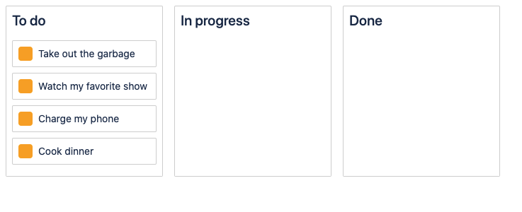
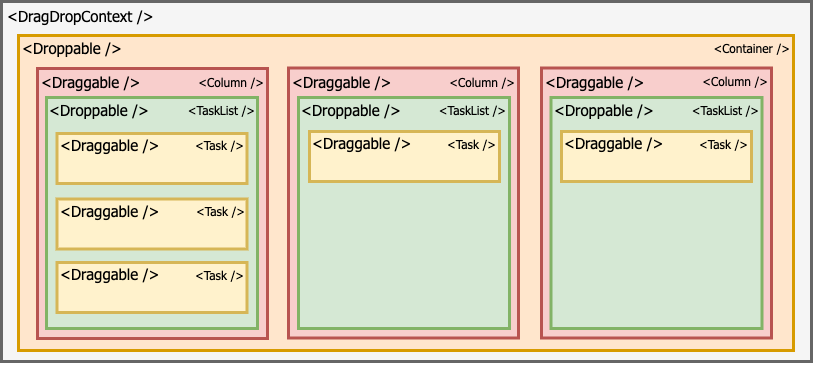

## React dnd example

Example of how to implement react-beautiful-dnd

  

### Component Diagram

  

---

Install `npm install`

Run development `npm start`

---

#### References
- [react-beautiful-dnd](https://github.com/atlassian/react-beautiful-dnd)
- [egghead tutorial](https://egghead.io/courses/beautiful-and-accessible-drag-and-drop-with-react-beautiful-dnd)